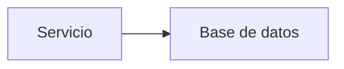

# Diagramas Mermaid

Convenciones para diagramas Mermaid en la documentación.

## Uso inline

Incluir diagramas directamente en archivos `.md`:

````markdown

````

MkDocs Material renderiza bloques `mermaid` automáticamente con la configuración en `mkdocs.yml`.

## Archivos externos

Para diagramas complejos o reutilizables, guardar el código fuente en esta carpeta y referenciar desde las páginas.

## Convenciones

- Usar IDs sin espacios en nodos (camelCase o guiones)
- Etiquetas con caracteres especiales entre comillas dobles
- Preferir `graph TB` o `graph LR` según la orientación del diagrama
