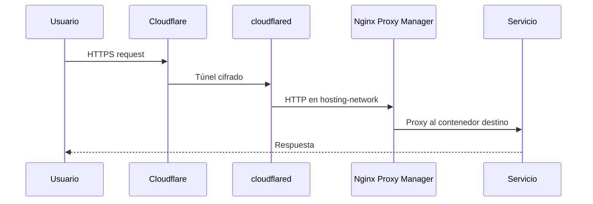
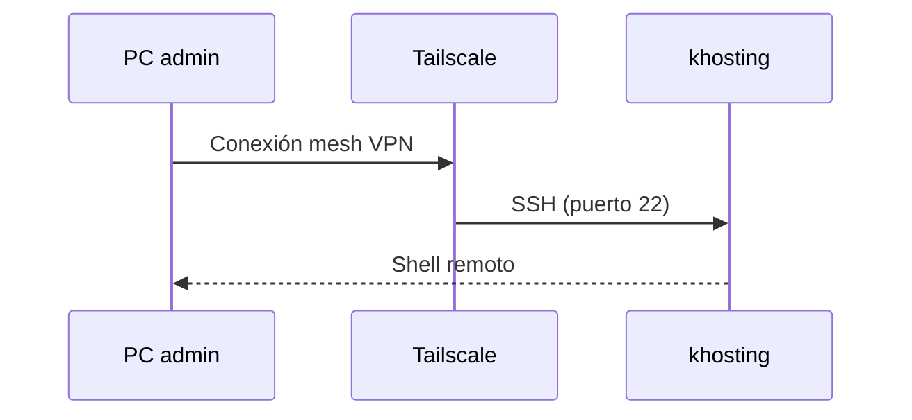

# Flujos de acceso

Dos caminos independientes: acceso público a servicios web y acceso administrativo por SSH.

## Acceso público (Internet → servicios)

### Pasos

1. El usuario resuelve un dominio gestionado en Cloudflare DNS.
2. Cloudflare enruta el tráfico al túnel configurado (`cloudflared`).
3. `cloudflared` reenvía la petición a Nginx Proxy Manager (puertos 80/443).
4. NPM aplica la regla de proxy host y envía al contenedor correspondiente (Jenkins, Kashflow, etc.).

!!! note "Sin puertos abiertos en el router"
    El túnel inicia conexiones salientes hacia Cloudflare. No hace falta port-forwarding en el router para servicios web.

### Servicios típicamente publicados

| Servicio | Publicación | Notas |
|----------|-------------|-------|
| Jenkins | NPM + túnel | Webhook de GitHub vía dominio público |
| Kashflow | NPM + túnel | App desplegada en `/workspace/kashflow` |
| Vaultwarden | NPM + túnel | `vault.kashflow.site` — gestor de contraseñas |
| MkDocs | NPM + túnel (opcional) | También accesible en LAN `:8000` |

## Modos de acceso

Resumen de cómo se alcanza cada servicio:

| Modo | Descripción | Servicios |
|------|-------------|-----------|
| **Solo LAN** | Bind `192.168.1.6:PUERTO`, sin dominio público | Portainer (`:9000`), Duplicati (`:8200`), FileBrowser (`:90`), Glances (`:61208`) |
| **Solo público** | `expose` en Docker + NPM + túnel, sin puerto en LAN | Jenkins, Vaultwarden (`vault.kashflow.site`) |
| **Dual** | LAN directa y opcionalmente dominio vía NPM + túnel | MkDocs (`:8000` + opcional `docs.*`), NPM (proxy `80/443` + admin LAN `:81`) |

Ver tabla completa en [Servicios](../services/index.md).

## Acceso administrativo (SSH)

### Pasos

1. Instalar Tailscale en el PC y en `khosting`.
2. Autenticar ambos nodos en la misma tailnet.
3. Conectar por SSH usando la IP Tailscale o MagicDNS del host.

!!! warning "Tailscale no enruta tráfico web"
    Tailscale se usa exclusivamente para acceso SSH y administración del host. Los servicios web no pasan por Tailscale.

## Acceso LAN (red local)

Servicios de gestión expuestos solo en la IP WiFi del host:

| Puerto | Servicio |
|--------|----------|
| 81 | NPM (admin) |
| 90 | FileBrowser |
| 8000 | MkDocs |
| 9000 | Portainer |
| 8200 | Duplicati |
| 61208 | Glances |

Bind address: `192.168.1.6` (interfaz WiFi).

## Enlaces relacionados

- [Tailscale](../networking/tailscale.md)
- [Cloudflare Tunnel](../networking/cloudflare-tunnel.md)
- [Nginx Proxy Manager](../networking/nginx-proxy-manager.md)
- [Runbook SSH vía Tailscale](../runbooks/ssh-tailscale.md)
