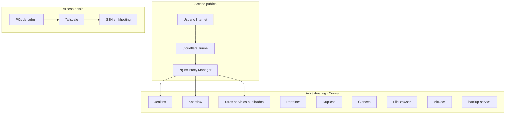

# Esquema del homelab

Visión general de cómo se conectan los componentes del homelab KHosting.

## Resumen

| Capa | Componente | Rol |
|------|------------|-----|
| Acceso público | Cloudflare Tunnel | Expone servicios a Internet sin abrir puertos en el router |
| Proxy | Nginx Proxy Manager | Termina TLS y enruta tráfico HTTP/HTTPS a contenedores |
| Orquestación | Docker Compose | Agrupa infra, monitoreo, docs y otros servicios |
| Acceso admin | Tailscale | VPN mesh para SSH entre PCs y el host |
| Host | khosting | Servidor físico (192.168.1.6 WiFi / 192.168.1.9 Ethernet) |

## Diagrama general

## Principios de diseño

1. **Un solo punto de entrada público:** todo el tráfico web pasa por Cloudflare Tunnel → NPM.
2. **Servicios internos en LAN:** Portainer, Duplicati, Glances y FileBrowser se publican solo en `192.168.1.6`.
3. **SSH solo por Tailscale:** no se expone SSH a Internet; los PCs se conectan vía mesh VPN.
4. **Red Docker compartida:** todos los contenedores usan `hosting-network`.

## Contenido de esta sección

- [Flujos de acceso](access-flows.md) — tráfico público vs administración
- [Topología de red](network-topology.md) — interfaces LAN, binds y red Docker

## Enlaces relacionados

- [Infraestructura](../infrastructure/index.md)
- [Redes](../networking/index.md)
- [Inventario de contenedores](../inventory/docker/containers/index.md)
- [Volver al inicio](../index.md)
