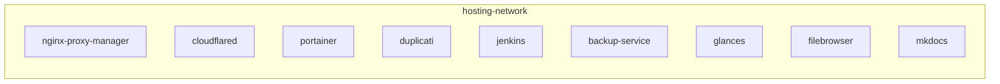
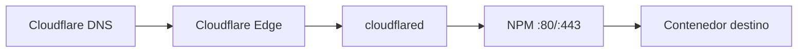

# Topología de red

Interfaces del host, red Docker y convenciones de publicación de puertos.

## Interfaces del host

| Interfaz | IP | Uso |
|----------|-----|-----|
| Ethernet | 192.168.1.9/24 | Red cableada |
| WiFi | 192.168.1.6/24 | Red inalámbrica — bind addresses de Docker |

!!! tip "Bind a WiFi"
    Los servicios de gestión se publican en `192.168.1.6` para limitar el acceso a la red local. NPM expone 80/443 en todas las interfaces porque el túnel y clientes LAN deben alcanzarlo.

## Red Docker: hosting-network

| Propiedad | Valor |
|-----------|-------|
| Nombre | `hosting-network` |
| Driver | bridge |
| Bridge name | `br-hosting` |
| Definida en | `docker-compose.yml` (raíz) |
| Uso | Todos los composes del monorepo |

Los composes hijos declaran la red como `external: true`; el orquestador raíz la crea.

## Mapa de puertos

### Públicos (0.0.0.0)

| Puerto | Servicio |
|--------|----------|
| 80 | NPM — HTTP |
| 443 | NPM — HTTPS |

### LAN only (192.168.1.6)

| Puerto | Servicio |
|--------|----------|
| 81 | NPM — panel admin |
| 90 | FileBrowser |
| 8000 | MkDocs |
| 8200 | Duplicati |
| 9000 | Portainer |
| 61208 | Glances |

### Solo red Docker (expose)

| Puerto | Servicio |
|--------|----------|
| 8080 | Jenkins |
| 50000 | Jenkins (agentes) |

## Flujo DNS → servicio

Ver [DNS](../networking/dns.md) para el patrón de registros.

## Enlaces relacionados

- [Servidor khosting](../inventory/servers/index.md)
- [Puertos](../inventory/networking/ports/index.md)
- [Redes Docker](../inventory/networking/networks/index.md)
- [Docker en infraestructura](../infrastructure/docker.md)
