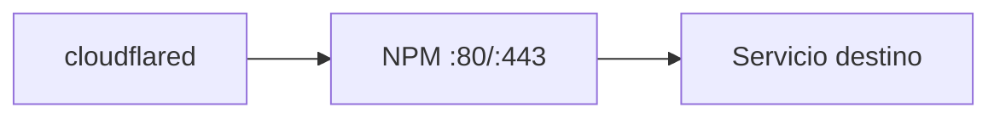

# Reverse Proxy

Configuración de proxy inverso y reglas de enrutamiento vía Nginx Proxy Manager.

## Componente

| Campo | Valor |
|-------|-------|
| Software | Nginx Proxy Manager |
| Contenedor | `nginx-proxy-manager` |
| Panel admin | `http://192.168.1.6:81` |
| HTTP/HTTPS | Puertos 80/443 (todas las interfaces) |

## Proxy hosts configurados

Completar con los hosts reales configurados en NPM:

| Dominio | Destino | SSL | Notas |
|---------|---------|-----|-------|
| _ejemplo_ | _contenedor:puerto_ | Let's Encrypt / Cloudflare | _descripción_ |

## Flujo

## Volúmenes

| Volumen | Contenido |
|---------|-----------|
| `npm-data` | Configuración SQLite |
| `npm-letsencrypt` | Certificados SSL |

## Enlaces relacionados

- [Servicio NPM](../../services/nginx-proxy-manager.md)
- [Redes — NPM](../../networking/nginx-proxy-manager.md)
- [Certificados](../certificates/index.md)
- [Dominios](../domains/index.md)
