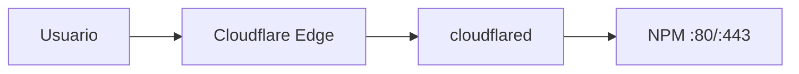

# Cloudflare Tunnel

Túnel saliente que expone servicios web sin abrir puertos en el router.

## Arquitectura



El contenedor `cloudflared` mantiene una conexión saliente persistente hacia Cloudflare. El tráfico entrante viaja por ese túnel hasta NPM.

## Configuración

| Campo | Valor |
|-------|-------|
| Contenedor | `cloudflared` |
| Imagen | `cloudflare/cloudflared:latest` |
| Compose | `infra/docker-compose.infra.yml` |
| Token | Variable `CLOUDFLARE_TOKEN` en `.env` |
| Dependencia | `nginx-proxy-manager` (debe estar arriba primero) |

```yaml
command: tunnel --no-autoupdate run --token ${CLOUDFLARE_TOKEN}
```

## Flujo

1. Crear túnel en el dashboard de Cloudflare Zero Trust.
2. Copiar el token al `.env` del host.
3. Configurar rutas del túnel apuntando a `http://nginx-proxy-manager:80` (o la IP del host).
4. NPM enruta cada dominio al contenedor destino.

## Operaciones

```bash
# Ver logs del túnel
docker compose logs -f cloudflared

# Reiniciar
docker compose restart cloudflared
```

## Enlaces relacionados

- [Servicio cloudflared](../services/cloudflare-tunnel.md)
- [Nginx Proxy Manager](nginx-proxy-manager.md)
- [DNS](dns.md)
- [Runbook: reiniciar NPM y túnel](../runbooks/restart-proxy-tunnel.md)
- [Troubleshooting](../troubleshooting/cloudflare-tunnel.md)
