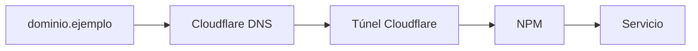

# DNS

Patrón de resolución de nombres para servicios del homelab.

## Modelo

Todos los dominios públicos se gestionan en **Cloudflare DNS**. El flujo es:

## Tipos de registro

| Tipo | Uso en este homelab |
|------|---------------------|
| CNAME | Apuntar subdominio al túnel Cloudflare |
| A | Solo si se expone IP directa (no recomendado con túnel) |

## Tabla de dominios

Completar con los hostnames reales configurados en Cloudflare y NPM:

| Dominio | Servicio | Proxy Host NPM | Notas |
|---------|----------|----------------|-------|
| _ejemplo.docs.domain_ | MkDocs | `mkdocs:80` | Documentación |
| _ejemplo.jenkins.domain_ | Jenkins | `jenkins:8080` | CI/CD |
| _ejemplo.app.domain_ | Kashflow | _contenedor:puerto_ | App principal |

!!! note "Completar según despliegue"
    Los dominios exactos dependen de la configuración en Cloudflare Zero Trust y NPM. Actualizar esta tabla al agregar servicios.

## DNS interno (LAN)

En la red local no se usa DNS interno. Los servicios de gestión se acceden por IP directa (`192.168.1.6:PUERTO`).

Tailscale ofrece MagicDNS para resolver el hostname del host dentro de la tailnet.

## Enlaces relacionados

- [Cloudflare Tunnel](cloudflare-tunnel.md)
- [Dominios en inventario](../inventory/domains/index.md)
- [DNS en inventario](../inventory/networking/dns/index.md)
