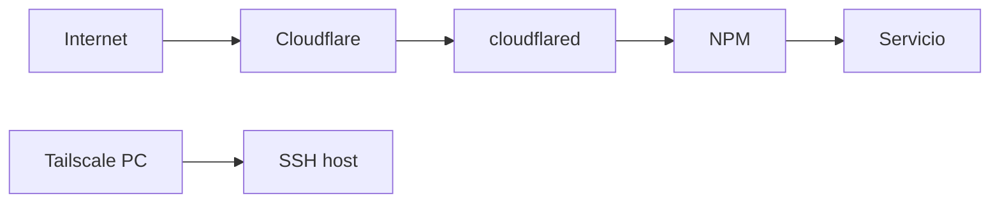

# Redes

Configuración de red, VPN, túneles, DNS y reverse proxy del homelab.

## Resumen

| Componente | Rol | Alcance |
|------------|-----|---------|
| [Tailscale](tailscale.md) | VPN mesh | SSH entre PCs y host |
| [Cloudflare Tunnel](cloudflare-tunnel.md) | Túnel saliente | Exposición pública de servicios web |
| [Nginx Proxy Manager](nginx-proxy-manager.md) | Reverse proxy | Enrutamiento HTTP/HTTPS interno |
| [DNS](dns.md) | Resolución de nombres | Dominios en Cloudflare |

## Flujo de tráfico

## Contenido

- [Tailscale](tailscale.md) — acceso SSH remoto
- [Cloudflare Tunnel](cloudflare-tunnel.md) — túnel público
- [Nginx Proxy Manager](nginx-proxy-manager.md) — reverse proxy
- [DNS](dns.md) — registros y dominios

## Enlaces relacionados

- [Esquema](../architecture/index.md)
- [Topología de red](../architecture/network-topology.md)
- [Inventario de redes](../inventory/networking/index.md)
