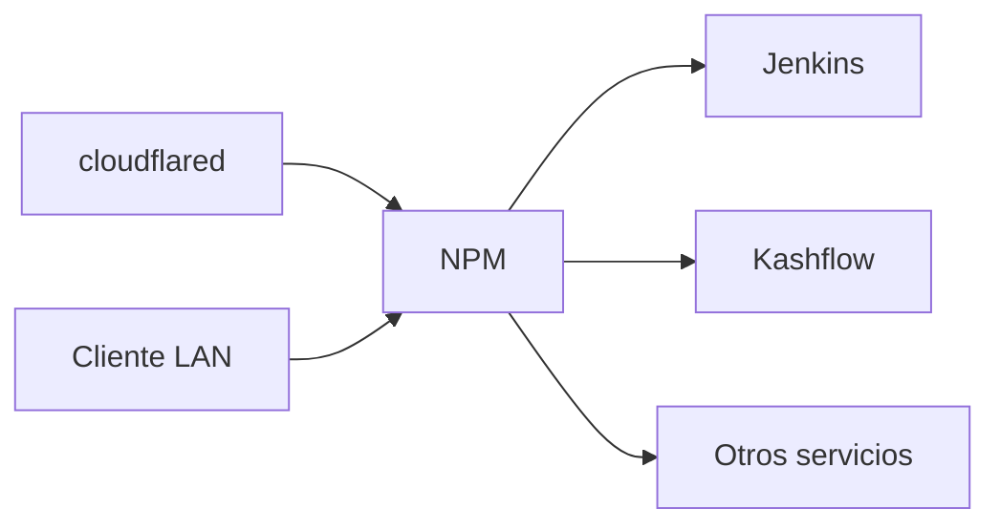

# Nginx Proxy Manager

Reverse proxy central del homelab. Termina TLS y enruta tráfico a contenedores.

## Rol en el stack

NPM es el punto de entrada interno para todo tráfico web:

## Puertos

| Puerto | Bind | Uso |
|--------|------|-----|
| 80 | 0.0.0.0 | HTTP (redirige a HTTPS) |
| 443 | 0.0.0.0 | HTTPS |
| 81 | 192.168.1.6 | Panel de administración |

## Configuración típica de proxy host

1. Acceder al panel en `http://192.168.1.6:81`
2. Crear **Proxy Host** con dominio y destino (hostname del contenedor + puerto)
3. Activar SSL con Let's Encrypt o certificado de Cloudflare
4. El túnel de Cloudflare apunta al dominio; NPM resuelve internamente

## Volúmenes

| Volumen | Contenido |
|---------|-----------|
| `npm-data` | Configuración y base SQLite |
| `npm-letsencrypt` | Certificados Let's Encrypt |

## Enlaces relacionados

- [Servicio NPM](../services/nginx-proxy-manager.md)
- [Reverse proxy en inventario](../inventory/reverse-proxy/index.md)
- [Certificados](../inventory/certificates/index.md)
- [Troubleshooting NPM](../troubleshooting/npm-routing.md)
